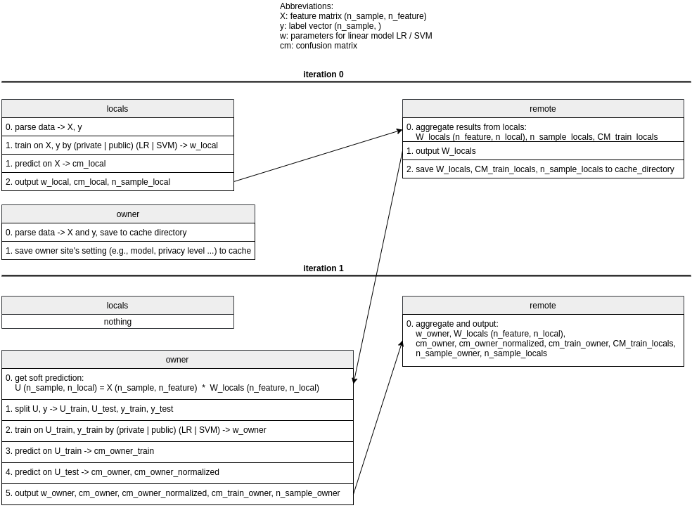

# COINSTAC_dpLR/SVM
COINSTAC implementation for differentially private regularized Logistic Regression (LR) / Support Vector Machines (SVM)

Run a testing case: `./run.sh`

### 1. Overview
This package allows a user at the owner site to build a binary classifier, which leverages classifiers built upon the data at other local sites, with -differential privacy. At both the owner and the local sites, the user can choose whether to build a **private** or **public** classifier and whether to use **LR** or **SVM** (using Huber loss) as the model. 

For the theoretical foundation and the algorithms of the differentially private LR and SVM, see [[1]](#1). Note we implemented the objective perturbation algorithm in [[2]](#2) instead of the one in [[1]](#1). 

### 2. Input
**Regularization parameter **: Highly depends on your data set. You might want to explore different settings. You can try logarithmically spaced first and then narrow in on a range. You don’t want to over-tune , so don’t do a very exhaustive search. See section 6 in [[1]](#1) for detailed suggestions.

**Huber constant  for SVM**: Lies between 0 and 0.5. Setting it too close to zero leads to numerical instability, and we usually set it to be .

**Privacy parameter **: Try values from 0.1 to 1.5. Depending on the problem you may need to go higher. Larger value means lower privacy.

### 3. Code
The following diagram shows the framework implemented in [local.py](scripts/local.py) and [remote.py](scripts/remote.py).

### References
<a id="1">[1]</a> 
 K.  Chaudhuri,  C.  Monteleoni,  and  A.  D.  Sarwate,  “Differentially  privateempirical risk minimization,” Journal of Machine Learning Research, vol. 12,no. Mar, pp. 1069–1109, 2011.

<a id="2">[2]</a> 
 ——, “Documentation for regularized lr and regularized svm code,” Available at http://cseweb.ucsd.edu/kamalika/code/dperm/documentation.pdf.
       